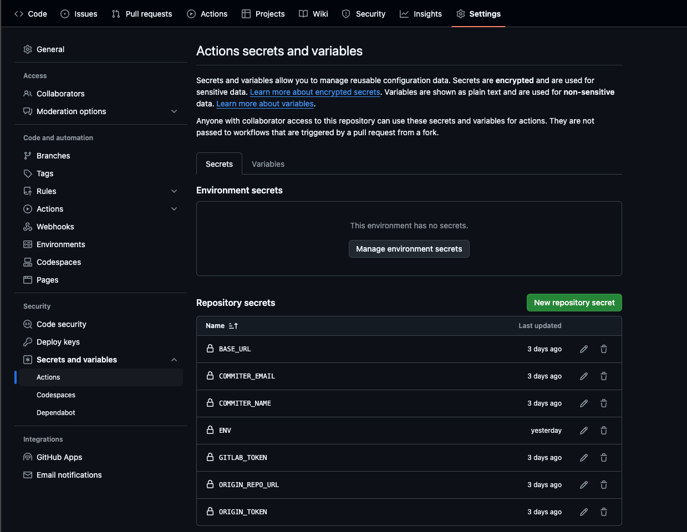

[](https://goreportcard.com/report/github.com/furmanp/gitlab-activity-importer)


# Git activity Importer (Gitlab -> Github)
A tool to transfer your GitLab commit history to GitHub, reflecting your GitLab activity on GitHub’s contribution graph.
# Table of Contents
- [Git activity Importer (Gitlab -\> Github)](#git-activity-importer-gitlab---github)
- [Table of Contents](#table-of-contents)
  - [Overview](#overview)
  - [Features](#features)
  - [Setup](#setup)
    - [1. Environmental Variables](#1-environmental-variables)
    - [2. Automatic Imports (Recommended)](#2-automatic-imports-recommended)
    - [3. Manual Imports using repository](#3-manual-imports-using-repository)
    - [4. Manual Imports using binary](#4-manual-imports-using-binary)
  - [Configuration](#configuration)
    - [Important Notes:](#important-notes)
  - [License](#license)


## Overview
This tool fetches your commit history from private GitLab repositories and imports it into a specified GitHub repository, creating a visual representation of your activity on GitHub’s contribution graph. It can be configured for automated daily imports or manual runs.

## Features
-	Automated Daily Imports: Syncs your GitLab activity with GitHub automatically each day.
-	Manual Imports: Allows on-demand updates.
-	Secure Data Handling: Requires minimal permissions and uses GitHub repository secrets for configuration.

## Setup
### 1. Environmental Variables

        | Secret Name       | Description                                                            |
        | ----------------- | ---------------------------------------------------------------------- |
        | `BASE_URL`        | URL of your GitLab instance (e.g., `https://gitlab.com`)               |
        | `GITLAB_USERNAME` | Your GitLab username                                                   |
        | `GH_USERNAME`     | Your GitHub username                                                   | 
        | `COMMITER_EMAIL`  | Email associated with your GitHub profile                              |
        | `GITLAB_TOKEN`    | GitLab personal access token (read permissions only)                   |
        | `ORIGIN_TOKEN`    | GitHub personal access token (with write permissions for auto-push)    |
        | `ORIGIN_REPO_URL` | HTTPS URL of your GitHub repository (ensure it has a `.git` extension) |

### 2. Automatic Imports (Recommended)
This approach will automatically keep your activity up to date. The program is being run daily at midnight UTC.
It imports your latest commits and automatically pushes them to specified GitHub repository.

To do that follow these steps:
1. **Fork this repository** to your GitHub account.
2. **Create an empty repository** in your GitHub profile where the commits will be pushed.
3. **Configure repository secrets** in your forked repository:
   - Go to your forked repository settings.
   - Under **Security**, navigate to **Secrets and variables > Actions**.
     
   - Add the secrets from section [1](#1-environmental-variables):


Once these variables are saved in your Repository secrets, your commits will be automatically updated every day.

### 3. Manual Imports using repository
>You need to have GO installed on your computer

If you prefer to run the importer manually:
1. Clone the repository
2. Create an `.env` file in the root of your project and provide necessary variables
3. Run the tool locally whenever you want to sync your activity using `go run ./cmd/go/main.go

### 4. Manual Imports using binary
1. **Download the latest release** of the tool.
2. Set up the same environment variables on your local machine:
```
export BASE_URL=https://gitlab.com
export GITLAB_USERNAME=your_gitlab_username
export GH_USERNAME=your_github_username
export COMMITER_EMAIL=your_email@example.com
...
```
3. Run the tool binary whenever you want to sync your activity.


## Configuration
This project uses GitHub Actions to automate builds and daily synchronization:

- GitHub Actions Workflow: The .github/workflows/schedule.yml defines the automation steps for building and running the tool.
- Secrets Configuration: The secrets allow secure storage and retrieval of required tokens and URLs during automation.

### Important Notes:
- **GitLab permissions:** The tool requires read-only access to your GitLab user and Gitlab repositories (`read_user` and `read_repository`)
- **GitHub permissions:** Your GitHub token must have write access to the destination repository for automatic pushes.

## License
This project is licensed under the MIT License, which allows for free, unrestricted use, copying, modification, and distribution with attribution.
